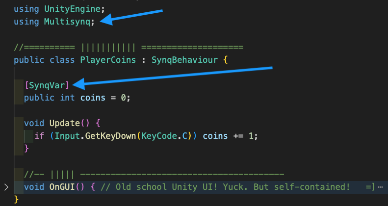

# Multisynq for Unity
Multisynq for Unity (M4U) is a Unity package that easily adds multiplayer to Unity games.

Skip the server code. Just add `[SynqVar]` and `[SynqRPC]` to any MonoBehaviour field or method, drop in an API key and you've got multiplayer running everywhere: Unity editor, built native, or WebGL.

Easy for simple projects, but scales to enable traffic-reducing, deterministic, bit-identical multiplayer-synchronization (multi-synq `=]` ).

Let's go. [Installing M4U](https://multisynq.io/docs/unity/build_assistant-installation.html)

Migrating over from Photon? Check out our [Migration Guide](https://multisynq.io/docs/unity/photon_migration_guide.html)

## Questions
Ask questions on our [discord](https://multisynq.io/discord)!

## Overview

Multisynq for Unity is a Multiplayer Package that helps you to build synchronized, bit-identical simulations with JavaScript. Deploy effortlessly everywhere without the hassle of server management, complex netcode, or rollback. Author how something behaves once, and it will behave that way for everyone playing your game. Snapshots? Handled. Catchup state? Handled.

- Model/View architecture with client deterministic synchronized computation eliminates netcode.
- Eliminate tons of network traffic due to client deterministic architecture.

This guide is quite handy to get going: [Installing M4U](https://multisynq.io/docs/unity/build_assistant-installation.html)

## How easy?

- Add C# attributes to your fields and methods.
  - `[SynqVar]` and `[SynqRPC]` (RPC = Remote Procedure Call)
- Swap MonoBehaviour for SynqBehaviour.
- Get the build assistant to all green checkmarks

*Like this:*

## The M4U Build Assistant

If only there was a checklist to get everything ready to run and build. Oh wait, there is.

The Build Assistant checks all the settings you'll need to get going and automatically troubleshoots stuff that might get in your way. From new scene to multiplayer calls and values, the build assistant has got your back.

## Deterministic (Advanced) Tutorials

Multiplayer (usually) has lots of limitations. Need a hoard of 5000 network-synched monsters? Ouch. Crazy physics everywhere? To get the best of both worlds (big synch, small traffic), you need deterministic, bit-identical computation in a model/view architecture. Computer science for the win! Why use bandwidth when you can activate identical clockwork compute on every player's machine? Sometimes, your net traffic is exactly zero as thousands of entities synchronously dance on all player screens.

This Multisynq package glues all the needed smarts into a comfy spot where you write simple game logic code. Nothing fancy. Multisynq gets that code running where it ought to be and just handles all the stuff that usually sucks: snapshots, late-joining, lag, catchup, prediction, etc. Less traffic. Lower costs. Astounding entity counts. Simpler code.

The tutorials below are an introduction to Deterministic Multisynq for Unity one concept at a time. Start here to dive in! Find these tutorials in the `Tutorials` section of the navigation bar.

Parts of these tutorials assume that you are familiarized with Croquet's [main concepts](https://multisynq.io/docs/croquet/index.html#main-concepts) and how [views](https://multisynq.io/docs/croquet/index.html#views) and [models](https://multisynq.io/docs/croquet/index.html#models) interact via [events](https://multisynq.io/docs/croquet/index.html#events).

### Unity Project
Croquet for Unity has been built with and tested on projects using Unity editor version `2021.3.19f1`. The easiest way to get started is to use the same version - but feel free to try a new version and tell us how it goes!

All Unity versions are available for download [here](https://unity.com/releases/editor/archive).

Create a new Unity Project via the Unity Hub Application.

Select a path to save your Unity project.

### git setup
Be sure to have a system level installation of git that is in your path variable. Unity will use this to resolve git repo based packages. Installation Instructions for git can be found at: https://git-scm.com/book/en/v2/Getting-Started-Installing-Git

Here are suggested .gitignore and .gitattributes files that we use in our Guardians demonstration project:
- [Guardians root gitignore](https://github.com/croquet/croquet-for-unity-guardians/blob/release/.gitignore)
- [Guardians Unity gitignore](https://github.com/croquet/croquet-for-unity-guardians/blob/release/unity/.gitignore)
- [Guardians Root gitattributes](https://github.com/croquet/croquet-for-unity-guardians/blob/release/.gitattributes)

### Included Dependencies

The Croquet for Unity package now includes essential networking dependencies, ensuring seamless integration and setup.

#### WebSocket

The package comes pre-integrated with the `WebSocketSharp-netstandard` library to facilitate the C# to JavaScript bridge. This removes the need for manual downloads or setup. The `websocket-sharp.dll`, compatible with `netstandard2.0`, is automatically placed in the correct directory within your Unity project, typically under `Assets/Plugins`, ensuring immediate functionality.

#### WebView

For platforms other than Windows, including any deployed applications, the package automatically incorporates a WebView component. This is essential for running the Croquet JavaScript code across various environments. The `unity-webview` package by GREE, Inc. is included out-of-the-box, negating the need for manual addition through the Unity Package Manager. This inclusion ensures that Multisynq for Unity operates across all supported platforms without additional configuration steps.

## Contribution
Contributions to the package are welcome as these projects are open source and we encourage community involvement.

1. Base your `feature/my-feature-name` or `bugfix/descriptor` branch off of `develop` branch
2. Make your changes
3. Open a PR against the `develop` branch
4. Discuss and Review the PR with the team
5. Changes will be merged into `develop` after PR approval

## Local Package Development

When changing and adding to the code of the package, you will want to set up a local way to experience the edits you make to the package dynamically. To do so, you will need to point to your local copy of the "io.multisynq.multiplayer" package instead of the one on github.
In your testing project folder, you will want to make an edit to the Package/manifest.json file:

For example in the file:

`m4u-tutorials/Tutorials/Packages/manifest.json`

Change the line:

    "io.multisynq.multiplayer": "https://github.com/multisynq/m4u-package.git",

To:

    "io.multisynq.multiplayer": "file:../../../m4u-package",

Of course, this folder path assumes you have a particular file structure with sibling project and package folders. Your path may vary a bit. Let the Unity Editor console log messages be your guide to get this wired up correctly.

With that edit to the manifest correctly set, just switching back to the Unity editor and it will load from your local folder instead of the github one. Code edits to the package code will be immediately compiled when focus is returned to the Unity Editor just like project code.
